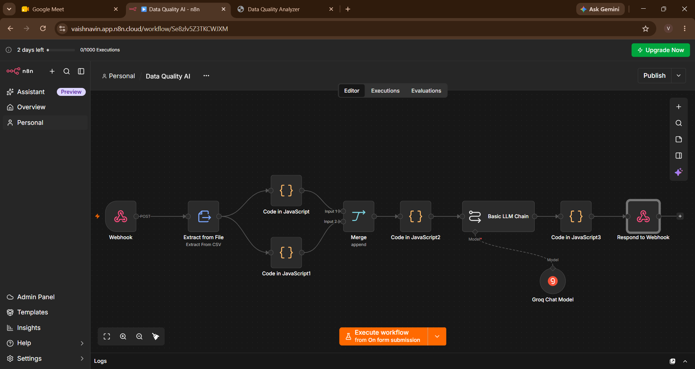
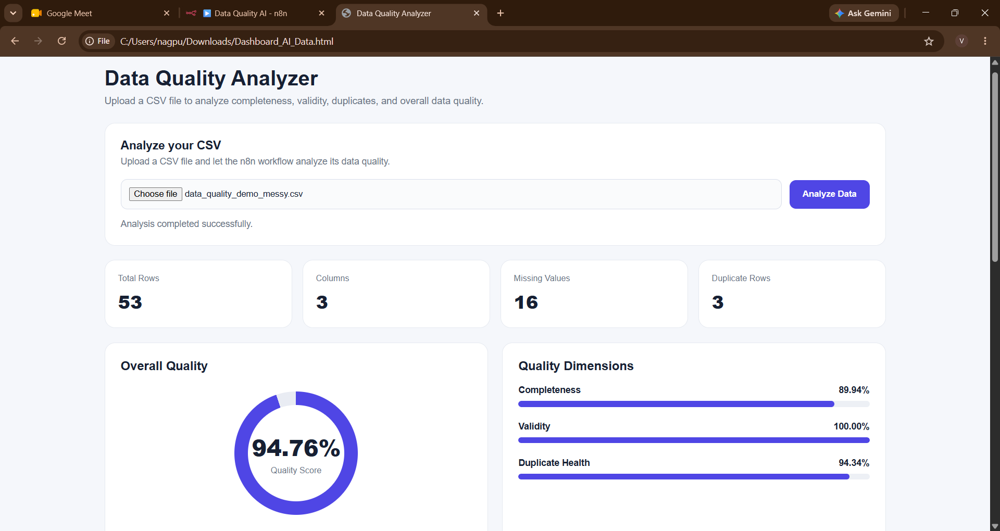
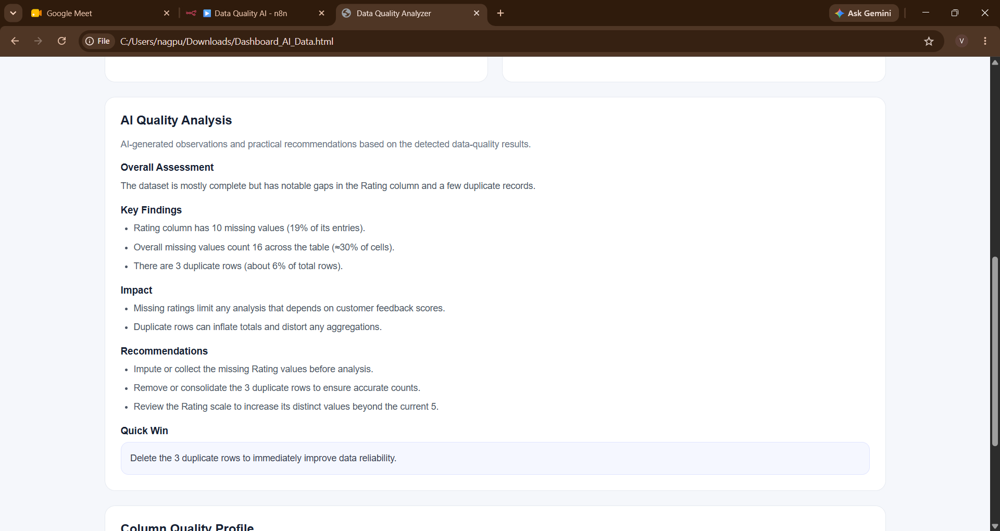
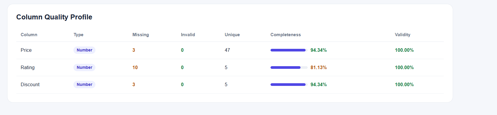

# 🚀 Data Quality Analyzer AI — n8n Workflow

### AI-powered CSV data quality analysis with an interactive dashboard

Upload a CSV file and automatically analyze its **completeness, validity, duplicates, and overall quality** — then get **dataset-specific AI insights and recommendations**.

Built with **n8n + JavaScript + Groq AI + HTML/CSS/JavaScript**.

---

## ✨ What Does It Do?

The Data Quality Analyzer automates the initial data-quality checking process.

Instead of manually inspecting a CSV, the workflow:

📂 **Accepts a CSV**
→ ⚙️ **Processes it with n8n**
→ 📊 **Calculates quality metrics**
→ 🤖 **Generates AI insights**
→ 📈 **Displays the results in a dashboard**

### Key capabilities

* 📊 Overall dataset quality analysis
* 🔍 Column-level profiling
* ⚠️ Missing-value detection
* 🔁 Duplicate detection
* ✅ Validity analysis
* 📈 Completeness calculation
* 🎯 Overall Quality Score
* 🤖 AI-generated findings
* 💡 Dataset-specific recommendations
* 🖥️ Interactive dashboard

---

## 🔄 Workflow

```text
                    📂 CSV Upload
                         │
                         ▼
                  🌐 n8n Webhook
                         │
                         ▼
                📄 Extract from File
                         │
              ┌──────────┴──────────┐
              ▼                     ▼
      📊 Overall Analysis    🔍 Column Analysis
              │                     │
              └──────────┬──────────┘
                         ▼
                    🔀 Merge
                         │
                         ▼
                 📋 Final Analysis
                         │
                         ▼
                 🤖 Basic LLM Chain
                         │
                         ▼
                    ⚡ Groq AI
                         │
                         ▼
              📤 Respond to Webhook
                         │
                         ▼
                  🖥️ Dashboard
```

---

## 🖥️ Dashboard

The custom dashboard provides a visual summary of the dataset.

### 📌 Dataset Overview

Displays:

* Total rows
* Total columns
* Missing values
* Duplicate rows
* Overall Quality Score

### 📊 Quality Dimensions

The dashboard evaluates three main dimensions:

| Dimension            | What it means                                          |
| -------------------- | ------------------------------------------------------ |
| **Completeness**     | How much expected data is present                      |
| **Validity**         | Whether available values follow the expected data type |
| **Duplicate Health** | How much of the dataset is free from duplicate records |

### 🔍 Column Quality Profile

Each column is analyzed for:

* Data type
* Total values
* Missing values
* Invalid values
* Unique values
* Completeness
* Validity

---

## 🤖 AI-Powered Analysis

The workflow uses a **Basic LLM Chain** connected to a **Groq Chat Model**.

The AI receives the quality information calculated by the n8n workflow and produces:

* 🔎 Key findings
* ⚠️ Impact of important issues
* 💡 Practical recommendations
* 🚀 One quick improvement

The AI is instructed to use the **actual dataset analysis**, so recommendations change according to the uploaded data rather than being fixed generic suggestions.

---

## 📸 Screenshots

### 🔧 n8n Workflow



### 📊 Dashboard Overview



### 🤖 AI Analysis



### 🔍 Column Quality Profile



---

## 🧪 Sample Datasets

Two sample datasets are included for testing.

### ⚠️ Messy Dataset

`data-quality-demo-messy.csv`

Contains intentional data-quality issues such as:

* Missing values
* Duplicate records

This demonstrates how the analyzer identifies problems.

### ✅ Clean Dataset

`data-quality-demo-clean.csv`

Contains:

* No missing values
* No duplicate records
* Consistent data types

This demonstrates how the analyzer handles a clean dataset.

---

## 🛠️ Technologies Used

| Technology                  | Purpose                                  |
| --------------------------- | ---------------------------------------- |
| **n8n**                     | Workflow automation                      |
| **JavaScript**              | Data processing and quality calculations |
| **Groq AI**                 | AI-powered analysis                      |
| **Basic LLM Chain**         | Sends analysis results to the AI model   |
| **HTML / CSS / JavaScript** | Custom dashboard                         |
| **Webhook**                 | Communication between dashboard and n8n  |

---

## 📂 Project Structure

```text
data-quality-analyzer-ai-n8n/
│
├── 📄 README.md
│
├── 📁 workflow/
│   └── data-quality-analyzer-ai.json
│
├── 📁 dashboard/
│   └── data-quality-dashboard.html
│
├── 📁 sample-data/
│   ├── data-quality-demo-messy.csv
│   └── data-quality-demo-clean.csv
│
└── 📁 screenshots/
    ├── workflow.png
    ├── dashboard-overview.png
    ├── ai-analysis.png
    └── column-profile.png
```

---

## 🚀 Setup & Usage

### 1️⃣ Import the n8n Workflow

Download:

`workflow/data-quality-analyzer-ai.json`

Import the workflow into your n8n instance.

### 2️⃣ Configure Groq AI

Create your own Groq API credential in n8n and connect it to the **Groq Chat Model** node.

> 🔐 API keys are not included in this repository.

### 3️⃣ Configure the Webhook

Open the dashboard HTML and replace:

```javascript
const WEBHOOK_URL = "YOUR_N8N_WEBHOOK_URL";
```

with your own n8n Webhook URL.

### 4️⃣ Open the Dashboard

Open:

`dashboard/data-quality-dashboard.html`

Upload one of the sample CSV files and click **Analyze**.

---

## 🎯 Example

Upload:

```text
data-quality-demo-messy.csv
```

The workflow analyzes the dataset and returns:

```text
CSV
 ↓
Data Extraction
 ↓
Quality Analysis
 ↓
Completeness / Validity / Duplicates
 ↓
AI Analysis
 ↓
Recommendations
 ↓
Dashboard
```

---

## 💡 Why I Built This

Data quality checking is an important step before using data for analytics, reporting, or further processing.

This project demonstrates how **automation and AI can work together** to make the initial data-quality checking process faster and easier.

Through this project, I gained hands-on experience with:

* n8n workflow automation
* Webhooks
* JavaScript data processing
* CSV analysis
* API integration
* LLM integration
* Dashboard development
* Data-quality concepts

---

## 🔮 Future Improvements

Possible future enhancements:

* 📄 Excel file support
* 🔎 More advanced validation rules
* 🧹 Automated data-cleaning options
* 📑 Exportable quality reports
* 📈 Historical quality tracking
* 📊 Additional data-quality metrics

---

## 👩‍💻 Project

**Data Quality Analyzer AI — n8n Workflow**

Built using:

`n8n` • `JavaScript` • `Groq AI` • `HTML` • `CSS` • `Webhooks`

⭐ If you find this project interesting, consider giving the repository a star!

